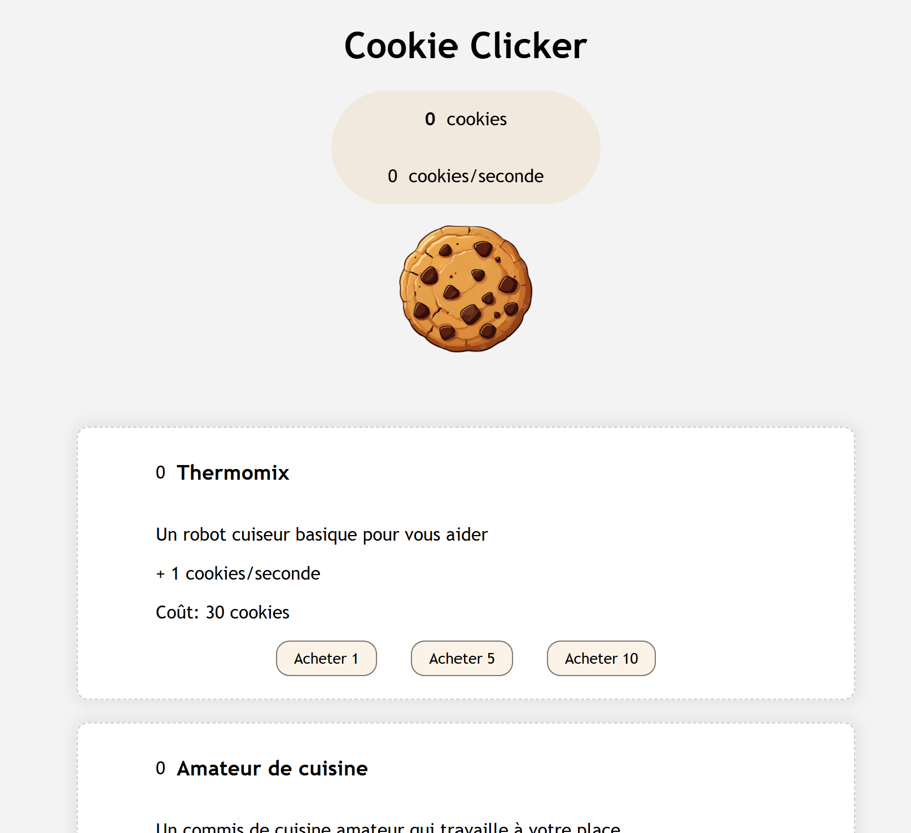

# Vuex Cookie Clicker

Un _Cookie Clicker_ pour tous les amateurs de cookies qui n'ont pas le temps de cuisiner.



---

### Prérequis

- **Node.js** : `^22.18.0` ou `>=24.12.0`
- Gestionnaire de paquets : `pnpm`, `npm` ou `yarn`

### Installer les dépendances

```bash
npm install
```

### Lancer le serveur de développement

```bash
npm run dev
```

L'application sera accessible sur `http://localhost:5173`.

---

## Scripts Disponibles

`npm run dev`, `npm run build`, `npm run format`
